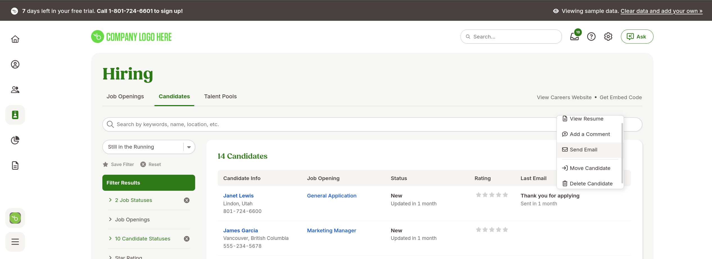

# Análise Bamboohr

## Análise das funcionalidades 

| N  | Funcionalidades                        | Detalhes                                                                                                                              | Implementado Mindsight? |
|----|---------------------------------------|-------------------------------------------------------------------------------------------------------------------------------------|--------------------------|
| 1  | Contratação em Múltiplos Canais       | Integração com plataformas como LinkedIn, Glassdoor, Indeed, ZipRecruiter e redes sociais para divulgar vagas e atrair candidatos.  | Sim                      |
| 2  | Página de Carreira Personalizável     | Criação de páginas de carreiras da empresa para centralizar informações sobre vagas e facilitar inscrições diretas.                  | Sim                      |
| 3  | Gerenciamento de Candidatos           | Registro de informações detalhadas sobre candidatos, como histórico de ações, avaliações, status no processo seletivo e observações. | Sim                      |
| 4  | Comentários e Colaboração             | Possibilidade de adicionar comentários e realizar interações diretas entre membros da equipe de recrutamento sobre candidatos.       | Não                      |
| 5  | Workflow Automatizado                 | Automatização de notificações e etapas do processo seletivo, como envio de e-mails automáticos aos candidatos.                       | Sim                      |
| 6  | Dashboard Centralizado                | Exibição de métricas gerais do processo seletivo, incluindo status de candidatos e insights sobre o funil de recrutamento.           | Não                      |
| 7  | Avaliação de Candidatos               | Ferramentas de avaliação para analisar candidatos com base em critérios definidos, incluindo sistema de classificação por estrelas.   | Sim                     |
| 8  | Relatórios e Análises de Contratação  | Geração de relatórios sobre o tempo de contratação, desempenho de candidatos e análise de gargalos no processo.                      | Sim                      |
| 9  | Assinatura de Contratos Eletrônicos   | Envio de cartas de oferta com preenchimento automático e assinatura eletrônica para agilizar a formalização da contratação.           | Não                      |
| 10 | Onboarding Digital                    | Transição do processo seletivo para onboarding com pacotes de boas-vindas customizáveis para novos contratados.                      | Não                      |
| 11 | Mobile App para Recrutamento          | Aplicativo móvel que permite gerenciar vagas, candidatos e comunicações a qualquer momento, com funcionalidades de visualização e ações rápidas. | Não                      |
| 12 | Funil de Recrutamento                 | Visualização do progresso de cada candidato em etapas como triagem, entrevista e contratação.                                        | Sim                      |
| 13 | Integração com Ferramentas de Calendário | Sincronização com calendários para agendamento e gerenciamento de entrevistas e eventos relacionados ao recrutamento.                 | Não                      |
| 14 | Gestão de Licenças e Benefícios       | Controle de saldo de licenças (férias, licença médica, etc.) e exibição de informações sobre planos de benefícios para colaboradores.  | Não                      |
| 15 | Alertas e Notificações                | Painel com lembretes automáticos sobre prazos, feedbacks pendentes, assinaturas de documentos e outras ações requeridas.              | Não                      |
| 16 | Time Off Requests                     | Funcionalidade para solicitação, aprovação e acompanhamento de licenças diretamente pela plataforma.                                 | Não                      |
| 17 | Gestão da Equipe                      | Visualização centralizada da equipe com informações de disponibilidade, ausência, e datas importantes, como aniversários.             | Não                      |
| 18 | Monitoramento de Treinamentos         | Controle de treinamentos incompletos e andamento dos programas de capacitação obrigatórios ou opcionais para os funcionários.         | Não                      |
| 19 | Insights sobre Desempenho             | Painel que exibe dados de desempenho, como colaboradores há mais de 12 meses sem aumento salarial ou outros indicadores.              | Não                      |
| 20 | Links Úteis Personalizados            | Área para disponibilizar links importantes para a equipe, como acesso a documentos, políticas e recursos da empresa.                  | Não                      |
| 21 | Gestão de Informações do Colaborador  | Área dedicada a centralizar dados pessoais e profissionais do colaborador, como cargo, status de emprego, informações de contato e departamento. | Não                      |
| 22 | Histórico de Trabalho e Benefícios    | Registro de informações sobre data de contratação, status de emprego (full-time/part-time), e detalhes sobre benefícios associados.  | Não                      |
| 23 | Gerenciamento de Documentos Pessoais  | Funcionalidade para armazenar e acessar documentos importantes do colaborador, como contratos, políticas assinadas, e outros arquivos relacionados. | Não                      |
| 24 | Personalização de Campos de Dados     | Possibilidade de adicionar e editar campos personalizados para atender necessidades específicas da empresa em relação às informações dos colaboradores. | Não                      |
| 25 | Controle de Equipamentos e Ativos     | Monitoramento e registro de equipamentos alocados aos colaboradores, como laptops, celulares e outros ativos corporativos.           | Não                      |
| 26 | Notas e Observações                   | Ferramenta para adicionar notas internas sobre o colaborador, garantindo confidencialidade e organização de informações específicas. | Não                      |
| 27 | Gestão de Treinamentos Individuais    | Controle sobre treinamentos concluídos ou pendentes de cada colaborador, com informações detalhadas sobre progresso e status.         | Não                      |
| 28 | Solicitação de Mudanças               | Funcionalidade que permite que colaboradores solicitem alterações em seus registros, como atualização de dados pessoais ou profissionais. | Não                      |
| 29 | Informações de Emergência             | Registro de contatos de emergência do colaborador para uso em situações críticas.                                                   | Não                      |
| 30 | Integração com Timesheets             | Permite rastrear horas trabalhadas diretamente associadas ao colaborador, vinculado a relatórios de pagamento e produtividade.       | Não                      |
| 31 | Assistente de Inteligência Artificial (AI) | Um assistente integrado que fornece suporte aos usuários em tempo real, respondendo a perguntas relacionadas a políticas da empresa, benefícios e procedimentos de RH. | Não                      |
| 32 | Organização Hierárquica               | Exibição de um organograma que permite visualizar a estrutura hierárquica da empresa, com funções de navegação para explorar equipes e supervisores. | Não                      |
| 33 | Diretório de Funcionários             | Lista completa de colaboradores ativos e inativos com filtros por localização, status de emprego e outros critérios.                | Não                      |
| 34 | Adição de Novos Funcionários          | Funcionalidade para registro de novos colaboradores, incluindo informações completas de contato, cargo e departamento.              | Não                      |
| 35 | Relatórios Customizáveis              | Ferramenta para criar relatórios personalizados com base em métricas específicas, como adições e desligamentos, uso de licenças, entre outros. | Não                      |
| 36 | Relatórios Padrão                     | Disponibilização de relatórios padrão como headcount, turnover e uso de benefícios, acessíveis de forma rápida.                     | Não                      |
| 37 | Favoritos em Relatórios               | Opção para salvar relatórios frequentemente acessados como favoritos, facilitando a navegação e a análise recorrente de dados.     | Não                      |
| 38 | Histórico de Relatórios Recentes      | Exibição de relatórios recentes acessados, organizados por período, como últimos 7 dias, com opções para abrir e editar.           | Não                      |
| 39 | Bem-vindo Interativo                  | Tela de boas-vindas interativa para novos usuários, com vídeos explicativos e passos guiados sobre como utilizar a plataforma.     | Não                      |
| 40 | Biblioteca de Documentos              | Área para armazenar e gerenciar documentos corporativos, com categorização por tipo (políticas, benefícios, etc.) e busca por nome. | Não                      |
| 41 | Upload de Arquivos                    | Possibilidade de realizar upload de documentos diretamente na plataforma para compartilhamento ou arquivamento centralizado.       | Não                      |
| 42 | Modelos de Assinatura                 | Armazenamento e gerenciamento de templates de assinatura para contratos e outros documentos legais.                                | Não                      |
| 43 | Controle de Políticas e Benefícios    | Centralização de documentos importantes como manuais da empresa, políticas de reembolso e resumos de benefícios.                   | Não                      |

## Print de telas

<b>Figura 1:</b> Página inicial 1.

<b>Figura 2:</b> Página inicial 2.

<b>Figura 3:</b> Página inicial 3.

<b>Figura 4:</b> Página inicial 4.

<b>Figura 5:</b> Página inicial 5.

<b>Figura 6:</b> Página de IA e Dashboard.

<b>Figura 7:</b> Página de arquivos da empresa.

<b>Figura 8:</b> Tela de boas-vindas interativa.

<b>Figura 9:</b> Página de relatórios - relatórios recentes.

<b>Figura 10:</b> Página de pessoas - listagem de funcionários.

<b>Figura 11:</b> Página de contratação 1

<b>Figura 12:</b> Página de contratação 2

<b>Figura 13:</b> Página de contratação 3

<b>Fonte:</b> [https://www.bamboohr.com/hr-software/applicant-tracking](https://www.bamboohr.com/hr-software/applicant-tracking), 2024.

## Histórico de versão 

| Versão | Data | Descrição | Autor(es) |
| :-: | :-: | :-: | :-: |
| `1.0` | 10/11/2024 | Criação do artefato de "Análise dos Concorrentes" | Vitor Feijó |
| `1.1` | 14/11/2024 | Preenchimento do artefato | Vitor Feijó |