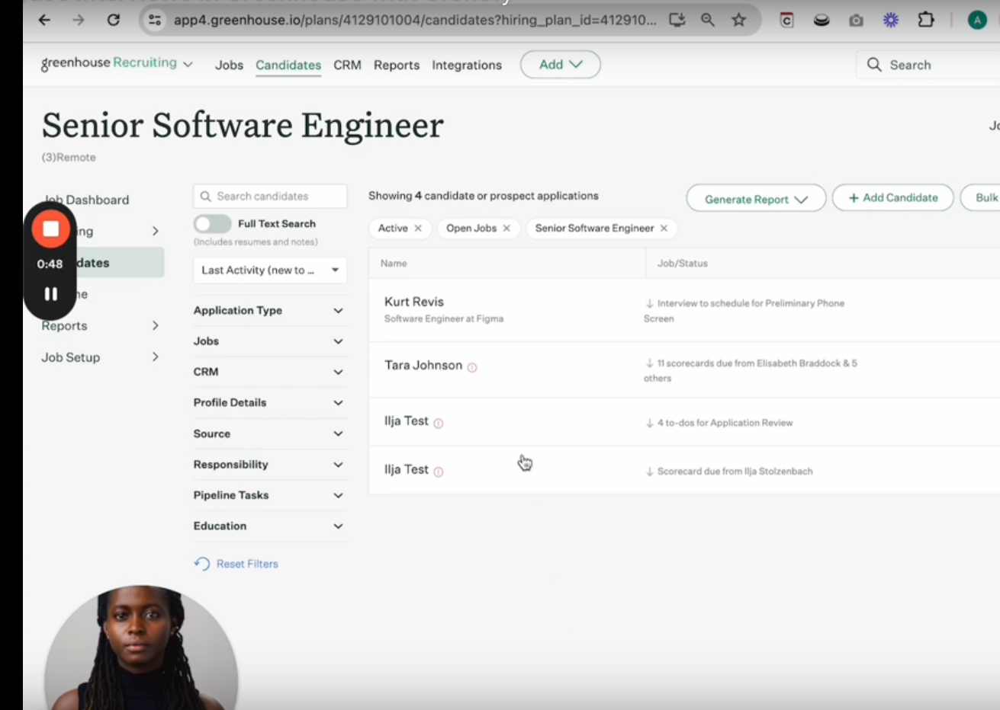
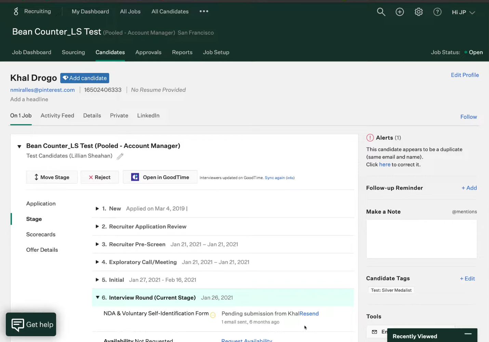
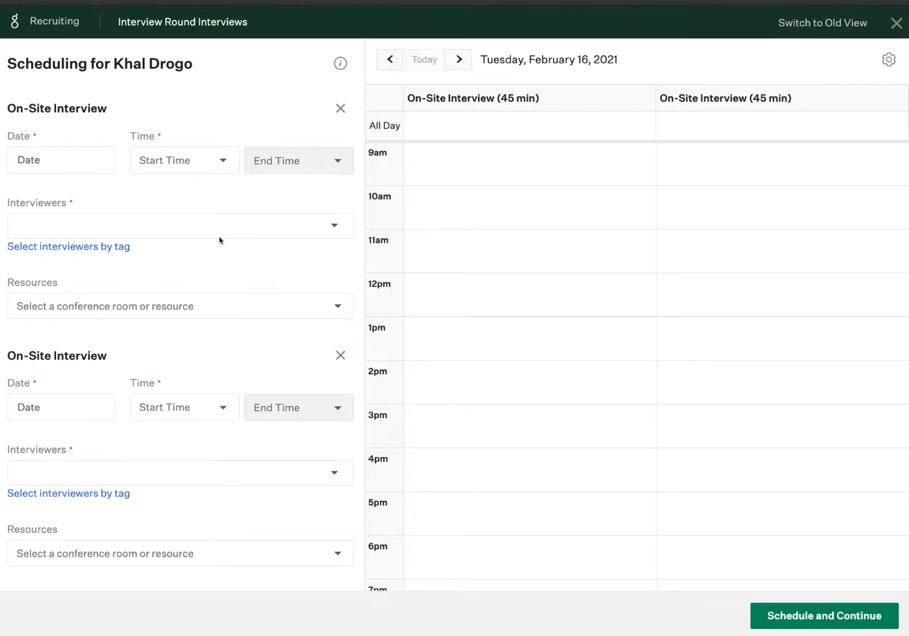

# Análise Bamboohr

## Análise das funcionalidades 

| N   | Funcionalidades Consolidada                                                                                              | Observações/Dúvidas                                                                                  | Implementado Mindsight? |
|-----|--------------------------------------------------------------------------------------------------------------------------|------------------------------------------------------------------------------------------------------|--------------------------|
| 1   | Parsing Automático de Currículos                                                                                        | Sistema avançado de análise de currículos que suporta 19 idiomas, permitindo a extração por foto de informações relevantes dos candidatos. | Não                      |
| 2   | Scorecard Personalizado e Avaliação Pré-definida                                                                         | Definição de critérios de avaliação padronizados que devem ser acordados pelos recrutadores antes de cada contratação, visando reduzir vieses e discriminação no processo seletivo. | Não                      |
| 3   | Agendamento e Autoagendamento de Entrevistas                                                                            | Agendamento centralizado de entrevistas, com seleção de entrevistadores, recursos e horários diretamente no sistema e inclui escolha flexível de horários pelos candidatos. | Não                      |
| 4   | Entrevistas e Tomada de Decisões                                                                                        | Organização de entrevistas colaborativas com planos estruturados e ferramentas como Zoom.           | Não                      |
| 5   | Processo de Onboarding                                                                                                  | Tarefas automatizadas para integração de novos colaboradores.                                       | Não                      |
| 6   | Alertas de Candidatos Duplicados e Rastreamento de Aplicações                                                           | Combinação de funcionalidades para evitar redundâncias no pipeline.                                 | Não                      |
| 7   | Ações em Massa e Filtros Avançados                                                                                      | Permite ações e buscas por critérios específicos como educação e experiência.                       | Sim                      |
| 8   | Gestão de Talent Pools e Engajamento                                                                                    | Gerenciamento de campanhas para manter o pipeline ativo.                                            | Sim                      |
| 9   | Página de Carreira Personalizada                                                                                       | Integração com o site corporativo para promover a marca empregadora.                                | Sim                      |
| 10  | Programas de Referência de Funcionários                                                                                 | Incentivo estruturado para recomendação de candidatos.                                              | Não                      |
| 11  | Quadro de Oportunidades Internas                                                                                       | Mobilidade interna para funcionários visualizarem vagas internas.                                   | Não                      |
| 12  | Análise de Fontes e Qualidade de Candidatos                                                                            | Painel consolidado para avaliação de qualidade por canal de recrutamento.                          | Não                      |
| 13  | Gestão de Colaboração no Recrutamento                                                                                  | Centralização de informações para equipes de recrutamento.                                          | Não                      |
| 14  | Campanhas Automatizadas e Nutrição                                                                                     | Envio automatizado de mensagens para engajar candidatos.                                            | Sim                      |
| 15  | Tradução de Linguagem                                                                                                   | Disponibilidade do sistema e quadros de vagas em 19 idiomas.                                        | Não                      |
| 16  | Fluxos de Trabalho Escaláveis                                                                                          | Configuração de fluxos de trabalho com etapas personalizáveis para aprovações e definições específicas por cargo ou departamento. | Não                      |
| 17  | Kits de Entrevista                                                                                                     | Ferramentas para organização e planejamento de entrevistas, incluindo preparação de perguntas e scorecards. | Não                      |
| 18  | Previsão de Aceitação de Ofertas                                                                                       | Uso de aprendizado de máquina para prever datas de aceitação de ofertas e início de trabalho com base em dados históricos. | Não                      |
| 19  | Formulários de Kickoff                                                                                                 | Formulários para capturar objetivos do negócio, habilidades e times de contratação, alinhando expectativas desde o início. | Não                      |
| 20  | Painel de Demografia e Diversidade                                                                                     | Análise do pipeline por dados demográficos, como gênero, para medir diversidade no processo seletivo. | Não                      |
| 21  | ROI de Fontes de Talento                                                                                               | Relatórios para identificar quais canais de recrutamento fornecem os candidatos mais qualificados e diversos. | Sim                      |
| 22  | Dashboards de Relatórios e Insights Automatizados                                                                      | Dados acessíveis em tempo real para responsabilização e monitoramento.                              | Sim                      |
| 23  | Exportação Fácil e Customização de Relatórios                                                                          | Possibilidade de criar relatórios específicos/personalizados para atender demandas organizacionais e exportação de dados do Greenhouse para planilhas e ferramentas de BI, como Tableau e Power BI. | Não                      |
| 24  | Integração com 529 Ferramentas                                                                                         | Possibilidade de escolher e integrar ferramentas de terceiros com mais de 529 opções, categorizadas por áreas: HRIS & onboarding, Job distribution, Sourcing, Screening tools, Productivity & collaboration, Candidate experience, Analytics. | Não                      |
| 25  | Relatórios Templates                                                                                                   | Acesso a mais de 40 relatórios pré-construídos que incluem métricas sobre atividades de recrutamento e pipeline. | Sim                      |
| 26  | Integração com Slack                                                                                                   | Atualizações importantes no processo de contratação, como aprovações e lembretes, diretamente no Slack. | Não                      |
| 27  | Gravação de Pronúncia de Nome                                                                                          | Opção para candidatos gravarem a pronúncia de seus nomes, facilitando a comunicação personalizada. | Não                      |
| 28  | Experiência Inclusiva do Candidato                                                                                     | Ferramentas para incentivar práticas inclusivas desde o início, como testes anônimos e seleção de pronomes preferidos. | Não                      |
| 29  | Integrações com Processos Internos                                                                                     | Coordenação de tarefas como testes práticos, verificações de antecedentes, assinaturas digitais e outros, centralizados no sistema. | Não                      |

## Print de telas

<b>Figura 1:</b> Página de candidatos 1.

<b>Figura 2:</b> Página de candidatos 2.

<b>Figura 2:</b> Página de etrevistas.

<b>Fonte:</b> [Greenhouse](https://www.greenhouse.com/), 2024.

## Histórico de versão 

| Versão | Data | Descrição | Autor(es) |
| :-: | :-: | :-: | :-: |
| `1.0` | 10/11/2024 | Criação do artefato de "Análise dos Concorrentes" | Vitor Feijó |
| `1.1` | 14/11/2024 | Preenchimento do artefato | Vitor Feijó |