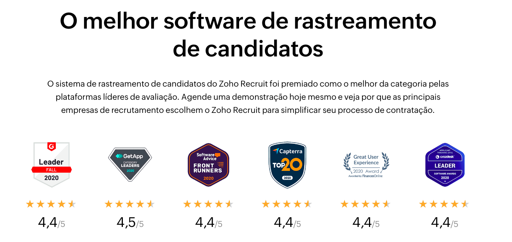

# Análise Zoho

| N | Funcionalidades | Detalhes |
| :-: | :-: | :-: | 
| 1 | Contratação em Múltiplos Canais | Integração com diversos portais de vagas para publicar anúncios e atrair candidatos de várias fontes. Inclui a possibilidade de criação de um site de carreiras para a empresa, onde os candidatos podem se inscrever diretamente. |
| 2 | Gerenciamento de Pipeline de Contratação | Oferece uma visão completa do processo de contratação, mostrando o estágio de cada candidato (triagem, entrevista, revisão, oferta, contratação) para facilitar o acompanhamento de todas as etapas do recrutamento. |
| 3 | Automação de Fluxos de Trabalho | Permite a criação de regras automáticas para agilizar tarefas, como notificações de entrevistas e rejeição de candidatos com base em critérios específicos. Reduz o tempo gasto em tarefas repetitivas. |
| 4 | Relatórios e Insights em Tempo Real | Gera relatórios sobre a origem dos candidatos e o status de cada um no processo de recrutamento. Inclui gráficos para análise de desempenho e acompanhamento de métricas de contratação. |
| 5 | Colaboração e Sincronização de Equipes | Permite comunicação interna entre a equipe de recrutamento por meio de menções e comentários, facilitando a colaboração e o compartilhamento de informações sobre os candidatos. |
| 6 | Avaliações Estruturadas | Fornece ferramentas para avaliação e triagem de candidatos com base em critérios específicos, permitindo que os recrutadores realizem uma análise mais objetiva e consistente ao longo do processo de entrevistas. |

## Autoridade

<b>Figura 1:</b> Premios do Zoho.

<b>Fonte:</b> [Zoho](https://www.zoho.com/pt-br/recruit/applicant-tracking-system.html), 2024.
