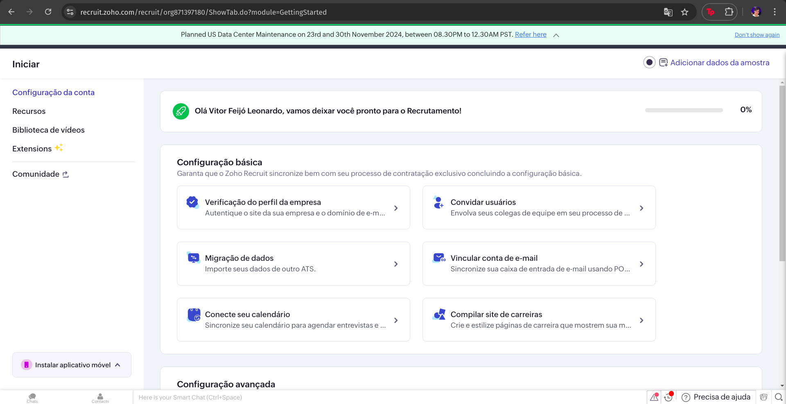
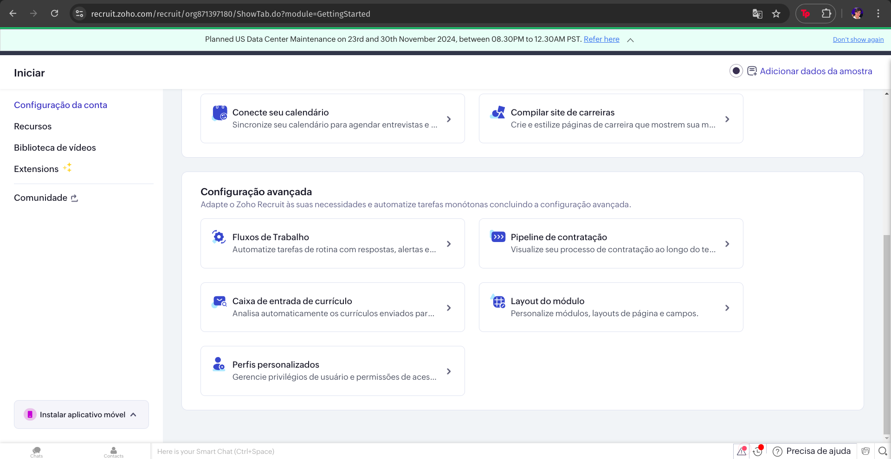
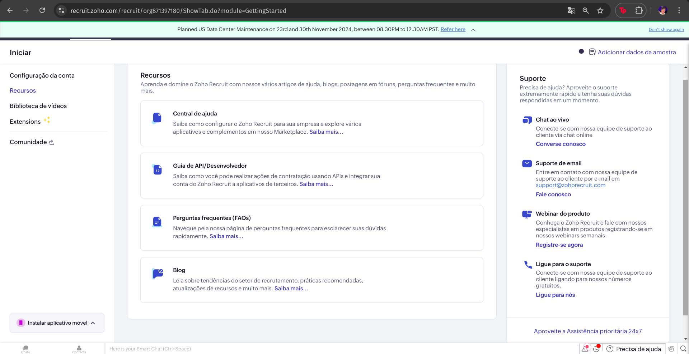
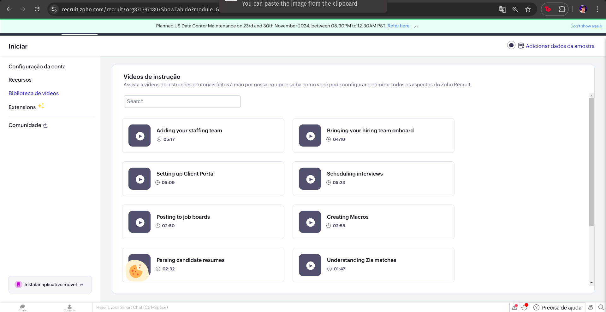
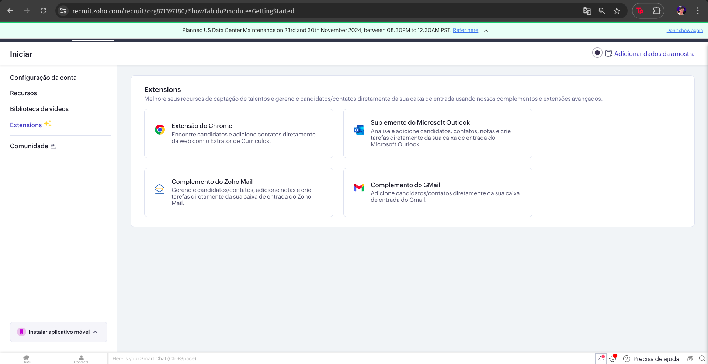
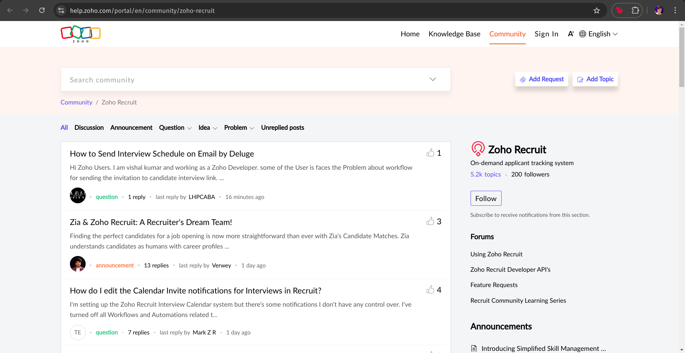
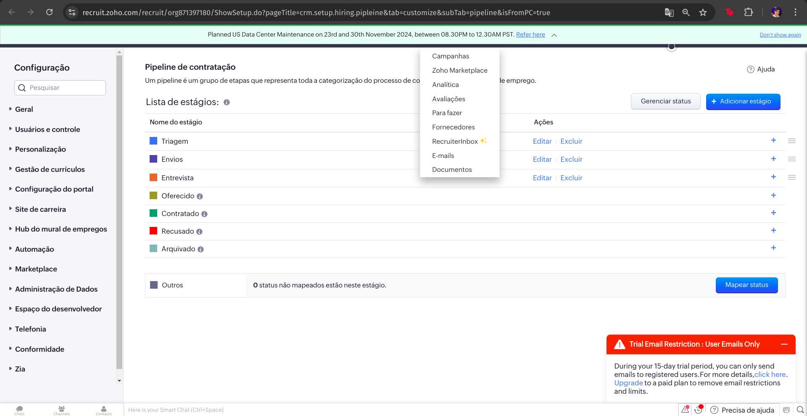
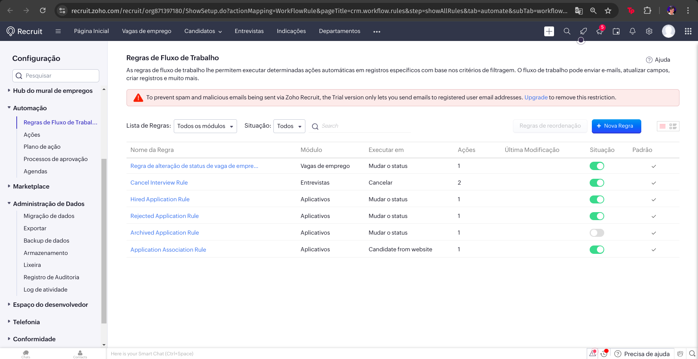
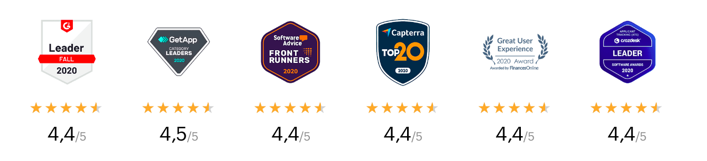

# Análise Zoho

## Análise das funcionalidades 

| N | Funcionalidades | Detalhes |
| :-: | :-: | :-: | 
| 1 | Contratação em Múltiplos Canais | Integração com diversos portais de vagas para publicar anúncios e atrair candidatos de várias fontes. Inclui a possibilidade de criação de um site de carreiras para a empresa, onde os candidatos podem se inscrever diretamente. |
| 2 | Gerenciamento de Pipeline de Contratação | Oferece uma visão completa do processo de contratação, mostrando o estágio de cada candidato (triagem, entrevista, revisão, oferta, contratação) para facilitar o acompanhamento de todas as etapas do recrutamento. |
| 3 | Automação de Fluxos de Trabalho | Permite a criação de regras automáticas para agilizar tarefas, como notificações de entrevistas e rejeição de candidatos com base em critérios específicos. Reduz o tempo gasto em tarefas repetitivas. |
| 4 | Relatórios e Insights em Tempo Real | Gera relatórios sobre a origem dos candidatos e o status de cada um no processo de recrutamento. Inclui gráficos para análise de desempenho e acompanhamento de métricas de contratação. |
| 5 | Colaboração e Sincronização de Equipes | Permite comunicação interna entre a equipe de recrutamento por meio de menções e comentários, facilitando a colaboração e o compartilhamento de informações sobre os candidatos. |
| 6 | Avaliações Estruturadas | Fornece ferramentas para avaliação e triagem de candidatos com base em critérios específicos, permitindo que os recrutadores realizem uma análise mais objetiva e consistente ao longo do processo de entrevistas. |
| 7 | Comunidade para Suporte e Interação | Oferece uma comunidade onde usuários podem interagir, discutir dúvidas e compartilhar soluções. Inclui categorias como discussão, problemas, ideias e perguntas para promover o engajamento. |
| 8 | Biblioteca de Vídeos Tutoriais | Disponibiliza uma série de vídeos tutoriais para guiar os usuários na configuração e otimização das funcionalidades do Zoho Recruit, cobrindo temas como agendamento de entrevistas e integração com portais de vagas. |
| 9 | Recursos de Suporte | Suporte disponível por chat ao vivo, e-mail e webinars de produto para auxiliar usuários em dúvidas e treinamento. Inclui central de ajuda, guia de API para desenvolvedores, perguntas frequentes e blog com atualizações. |
| 10 | Configuração Avançada | Oferece opções de personalização, como configurações de fluxo de trabalho, pipeline de contratação, entrada de currículo, layout de módulos e perfis personalizados para ajustar o sistema às necessidades da empresa. |
| 11 | Extensões e Integrações com E-mail | Compatível com extensões para navegadores e complementos para Gmail, Zoho Mail e Outlook, permitindo adicionar contatos e gerenciar candidatos diretamente da caixa de entrada. |
| 12 | Página Inicial | Acesso à visão geral ou dashboard principal do ATS, com informações e métricas gerais sobre o processo de recrutamento. |
| 13 | Vagas de Emprego | Área para listar, gerenciar e publicar vagas abertas, com possibilidade de criar novas vagas e personalizar descrições. |
| 14 | Candidatos | Seção dedicada ao gerenciamento de candidatos, com opções para visualizar o pipeline de cada um e realizar ações como qualificar, aprovar ou descartar. |
| 15 | Entrevistas | Área para agendamento e gerenciamento de entrevistas, incluindo funcionalidades de calendário e sincronização com outras ferramentas. |
| 16 | Regras de Fluxo de Trabalho | Lista de regras que automatizam ações específicas (ex.: cancelar entrevista, mudar status de candidatos), configuráveis para diferentes módulos como "Vagas de Emprego" e "Entrevistas". |
| 17 | Pipeline de Contratação | Configuração de estágios para categorizar o status dos candidatos (ex.: triagem, entrevista, oferecido, contratado, recusado), permitindo uma visualização clara do progresso de cada candidato no processo de recrutamento. |
| 18 | Administração de Dados | Inclui funcionalidades de importação e exportação de dados, backup, armazenamento, lixeira, registro de auditoria e log de atividade para garantir a segurança e conformidade dos dados. |

## Print de telas

<b>Figura 1:</b> Configuração da conta do ATS.

<b>Figura 2:</b> Configuração da conta o ATS.

<b>Figura 3:</b> Recursos auxiliares o ATS.

<b>Figura 4:</b> Videos auxiliares do ATS.

<b>Figura 5:</b> Extensões do ATS.

<b>Figura 6:</b> Comunidade do ATS.

<b>Figura 7:</b> Configuração avançada > Pipeline de contratação

<b>Figura 8:</b> Regras de fluxo de trabalho

<b>Fonte:</b> [Zoho](https://www.zoho.com/pt-br/recruit/applicant-tracking-system.html), 2024.

## Autoridade

<b>Figura 1:</b> Premios do Zoho.

<b>Fonte:</b> [Zoho](https://www.zoho.com/pt-br/recruit/applicant-tracking-system.html), 2024.
