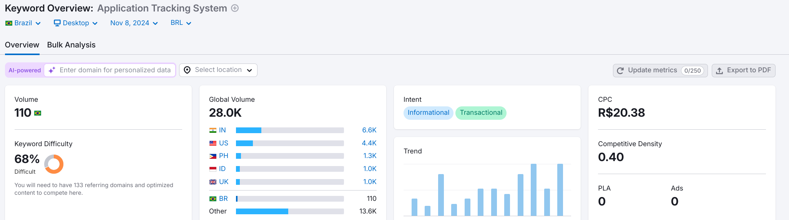

# Insights SEMRUSH

## Introdução

Este artefato apresenta uma análise estratégica realizada com a ferramenta Semrush, que combina funcionalidades de pesquisa de palavras-chave, tendências de mercado, SEO e monitoramento competitivo em um único ambiente. A análise inicia com um overview do domínio da Mindsight, oferecendo insights sobre sua presença digital e performance. Em seguida, é realizada uma análise dos concorrentes. Por fim, o artefato explora a palavra-chave "application tracking system", destacando seu potencial e relevância para a estratégia digital da Mindsight.

## Metodologia

Utilizando a ferramenta do Semrush, foram seguidos os seguintes passos:

1. **Visão geral do domínio:** Enxergar o volume de tráfego orgânico, principais palavras-chave orgânicas, palavras-chave por intenção, distribuição por país.
2. **Concorrentes orgânicos:** Identificar os concorrentes orgânicos da Mindsight.
3. **Visão geral de palavra-chave:** Analisar a palavra-chave "Application Tracking System", o volume dificuldade da palavra-chave, intenção, tendência, Custo por Clique (CPC) e ideias de palavra-chave próximas.

## Resultados

### 1. Visão geral do domínio

<b>Planilha 1:</b> Planilha de visão geral do domínio da Mindsight.

<iframe src="https://docs.google.com/spreadsheets/d/e/2PACX-1vTGP-BesLmxgIWFrD2g81P2suHkgUWXs_hZbRvX7CQzuJ6dd8OfdUnD8imWxd_zQDOVhI3njLQ39rni/pubhtml?widget=true&amp;headers=false" height="400px"></iframe>

<b>Fonte:</b> [Semrush](https://www.semrush.com/), 2024.

### 2. Concorrentes orgânicos

<b>Planilha 2:</b> Lista de concorrentes gerados pelo SEMRUSH.

<iframe src="https://docs.google.com/spreadsheets/d/e/2PACX-1vQbhrBpn5u9lRgA9-dFSg0EbJLWwYYIAtBeDPE1DhMbedFJwfZFTnbDWEAW3OTF_jtDZPK306uky_Va/pubhtml?widget=true&amp;headers=false" height="400px"></iframe>

<b>Fonte:</b> [Semrush](https://www.semrush.com/), 2024.

### 3. Visão geral de palavra-chave

<b>Figura 1:</b> Dashboard de visão geral da palavra-chave "Application Tracking System".

<b>Fonte:</b> [Semrush](https://www.semrush.com/), 2024.

<b>Planilha 3:</b> Planilha com ideias de palavras-chave próximas.

<iframe src="https://docs.google.com/spreadsheets/d/e/2PACX-1vTGQPc1ly1BvLJAb9Z0A_dYp-n7I3y_W52J2f9vXZiUvycqcCQUVbWwH9ORaZxW0FtT9b2CQwG3mBVG/pubhtml?widget=true&amp;headers=false" height="400px"></iframe>

<b>Fonte:</b> [Semrush](https://www.semrush.com/), 2024.

## Bibliografia

></a> 1. SEMRUSH. Semrush: Ferramenta de Marketing Digital. Disponível em: [https://pt.semrush.com/projects/](https://pt.semrush.com/projects/). Acesso em: 18 nov. 2024.

## Histórico de versão
| Versão | Data | Descrição | Autor(es) |
| :-: | :-: | :-: | :-: |
| `1.0` | 08/11/2024 | Criação do artefato de "semrush" | Vitor Feijó |
| `1.1` | 10/11/2024 | Preenchimento do artefato | Vitor Feijó |