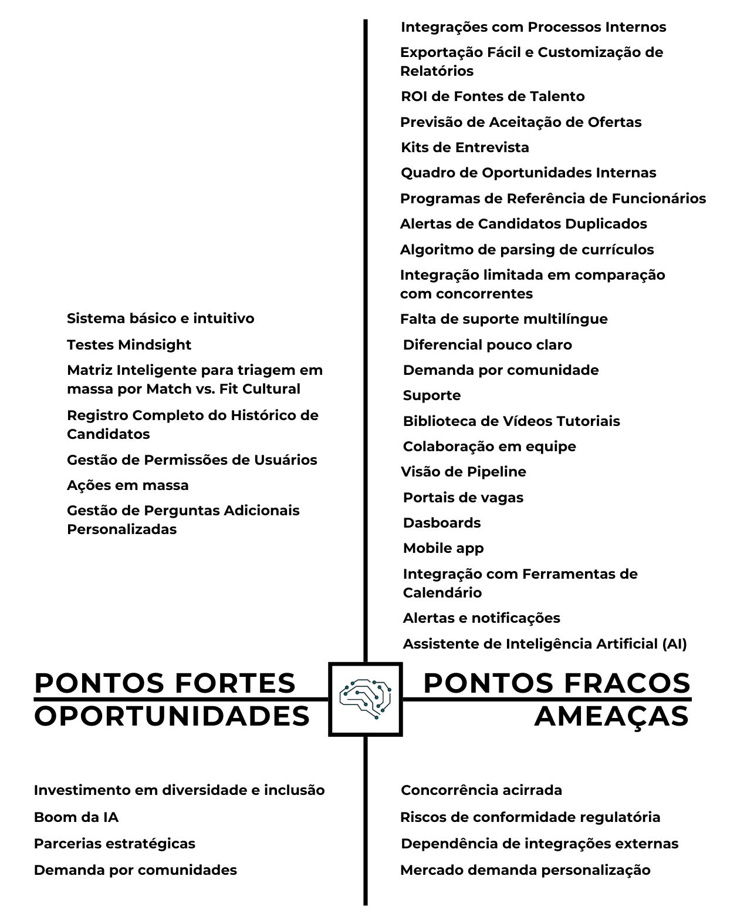

# Análise SWOT

## Introdução

Este artefato apresenta uma Análise SWOT (Forças, Fraquezas, Oportunidades e Ameaças) desenvolvida para compreender melhor o posicionamento estratégico frente ao mercado de sistemas de rastreamento de candidatos (ATS). A SWOT é uma ferramenta amplamente utilizada para identificar fatores internos e externos que podem impactar o desempenho de uma organização ou produto. Para elaborar esta análise, foram considerados os resultados obtidos nos artefatos de análise de concorrentes previamente desenvolvidos, permitindo uma avaliação informada e embasada em tendências reais do mercado. O objetivo é identificar vantagens competitivas, áreas de melhoria, oportunidades de crescimento e riscos potenciais, contribuindo para a construção de estratégias mais robustas e eficazes.

## Metodologia

A metodologia aplicada na construção desta análise SWOT seguiu as etapas descritas abaixo:

1. Coleta de dados base: Foram utilizados os artefatos de análise de concorrentes previamente desenvolvidos, que contêm informações detalhadas sobre os sistemas ATS dos concorrentes, suas funcionalidades, pontos fortes e fracos, além de tendências de mercado identificadas.
2. Construção da Matriz SWOT: Com base na classificação das informações, foi elaborada a matriz SWOT, estruturando os fatores internos (forças e fraquezas) e externos (oportunidades e ameaças) em seus respectivos quadrantes. 

## Resultados

<b>Figura 1:</b> Análise SWOT.

<b>Autor:</b> Vitor Feijó, 2024.

### Pontos Fortes

1. **Sistema básico e intuitivo:** tem as principais funcionalidades de mercado e apresenta uma boa usabilidade.
2. **Testes Mindsight:** os testes Mindsight são um grande complementao ao sistema de ATS.
3. **Matriz Inteligente para triagem em massa por Match vs. Fit Cultural:** é uma funcionalidade diferencial. 
4. **Registro Completo do Histórico de Candidatos:** Histórico detalhado de todas as ações realizadas no processo seletivo, garantindo total rastreabilidade e conformidade.
5. **Gestão de Permissões de Usuários:** Controle granular de acessos, permitindo que administradores configurem permissões específicas para diferentes perfis de usuários.
6. **Ações em massa:** Função prática e eficiente que permite reprovar, mover entre etapas, ou enviar notificações por e-mail para múltiplos candidatos simultaneamente, otimizando a gestão de grandes pipelines.
7. **Gestão de Perguntas Adicionais Personalizadas:** Empresas podem incluir perguntas específicas no formulário de inscrição para obter informações precisas sobre os candidatos, ajustadas à realidade de cada vaga.

### Pontos Fracos

1. **Integração limitada em comparação com concorrentes:** Concorrentes como Greenhouse suportam mais de 500 integrações com ferramentas de terceiros, enquanto o ATS da Mindsight não destaca extensibilidade semelhante. 
2. **Falta de suporte multilíngue:** O sistema parece limitado a um único idioma, o que restringe sua aplicação internacional.
3. **Diferencial pouco claro:** Não fica muito evidente qual é o diferencial para se escolher o ATS da Mindsight, faltam algumas funcionalidades inovadoras da concorrência.
4. **Demanda por comunidade:** As empresas tem dificuldades similares no assunto em questão e podem ter dificuldade de usar um sistema, então é interessante criar uma comunidade das empresas que usam o sistema para trocarem experiências e fornecer soluções para problemas.
5. **Suporte:** Poderia ter um foco em aumentar os recursos de suporte via chat, e-mail, webinars, central de ajuda, guia de API para desenvolvedores, perguntas frequentes e blog.
6. **Biblioteca de Vídeos Tutoriais:** Poderia ter vídeos tutoriais para os recutadores, poderia ter um vídeo "welcome" ao abrir o sistema pela primeira vez. 
7. **Colaboração em equipe:** Poderia haver um módeulo de comunicação interna para a equipe de recrutamento por menções e comentários. 
8. **Visão de Pipeline** Poderia haver um como se fosse uma visualização CRM dos condidatos mostrando o estágio de cada candidato (triagem, entrevista, revisão, oferta, contratação).
9. **Portais de vagas:** poderia expandir os número de portais de vagas em que se é publicado o anúncio da vaga. 
10. **Dasboards:** além dos relatórios, poderia se ter uma página com dados, status dos candidatos e insights sobre o funil de recrutamento.  
11. **Mobile app:** Aplicativo móvel que permite gerenciar vagas, candidatos e comunicações a qualquer momento, com funcionalidades de visualização e ações rápidas.
12. **Integração com Ferramentas de Calendário:** Sincronização com calendários para agendamento e gerenciamento de entrevistas e eventos relacionados ao recrutamento..
13. **Alertas e notificações:** Painel com lembretes automáticos sobre prazos, feedbacks pendentes, assinaturas de documentos e outras ações requeridas.
14. **Assistente de Inteligência Artificial (AI):** Um assistente integrado que fornece suporte aos usuários em tempo real, respondendo a perguntas relacionadas a políticas da empresa, benefícios e procedimentos de RH.
15. **Algoritmo de parsing de currículos:** não há um diferencial nesse algoritmo ao que aparenta. 
16. **Alertas de Candidatos Duplicados**: Combinação de funcionalidades para evitar redundâncias no pipeline.
17. **Programas de Referência de Funcionários:** Incentivo estruturado para recomendação de candidatos.
18. **Quadro de Oportunidades Internas:** Mobilidade interna para funcionários visualizarem vagas internas.
19. **Kits de Entrevista:** Ferramentas para organização e planejamento de entrevistas, incluindo preparação de perguntas e scorecards.
20. **Previsão de Aceitação de Ofertas:** Uso de aprendizado de máquina para prever datas de aceitação de ofertas e início de trabalho com base em dados históricos.
21. **ROI de Fontes de Talento:** Relatórios para identificar quais canais de recrutamento fornecem os candidatos mais qualificados e diversos.
22. **Exportação Fácil e Customização de Relatórios:** Possibilidade de criar relatórios específicos/personalizados para atender demandas organizacionais e exportação de dados do Greenhouse para planilhas e ferramentas de BI, como Tableau e Power BI.
23. **Integrações com Processos Internos:** Coordenação de tarefas como testes práticos, verificações de antecedentes, assinaturas digitais e outros, centralizados no sistema.

### Oportunidades

1. **Investimento em diversidade e inclusão:** Incorporar ferramentas, algoritmos e novas funcionalidades que promovam a diversidade e inclusão como recursos de acessibilidade, testes anônimos, seleção de pronomes preferidos, multiplicidade de idiomas, scorecard. 
2. **Boom da IA:** Adicionar recursos como previsão de aceitação de ofertas e análise de dados baseada em aprendizado de máquina aumentaria a competitividade e aceitação do mercado cuja popularidade da IA está massificada. 
3. **Parcerias estratégicas:** Firmar parcerias com plataformas emergentes de vagas ou ferramentas de colaboração, como Slack, e outras ampliaria o valor da solução.

### Ameaças

1. **Concorrência acirrada:** mais de 60 ATSs mapeados e alguns sistemas mais consolidados possuem funcionalidades diferenciadas e maior penetração de mercado.
2. **Riscos de conformidade regulatória:** Leis de proteção de dados como a LGPD e GDPR impõem desafios técnicos e operacionais que devem ser continuamente atendidos.
3. **Dependência de integrações externas:** Problemas nas plataformas integradas (LinkedIn, Google For Jobs, etc.) podem afetar a experiência do usuário. Além de que algumas APIs devem ser solicitadas e nem todas concedidas, o que precisaria de um tempo para formar boas e duradouras parcerias.
4. **Mercado demanda personalização:** O mercado demanda personalização nos sitemas o que é péssimo para manutenabilidade.

## Bibliografia

></a> 1. SEMRUSH. Semrush: Ferramenta de Marketing Digital. Disponível em: [https://pt.semrush.com/projects/](https://pt.semrush.com/projects/). Acesso em: 18 nov. 2024.

## Histórico de versão

| Versão | Data | Descrição | Autor(es) |
| :-: | :-: | :-: | :-: |
| `1.0` | 10/11/2024 | Criação do artefato de "Análise SWOT" | Vitor Feijó |
| `1.1` | 16/11/2024 | Preenchimento do artefato | Vitor Feijó |