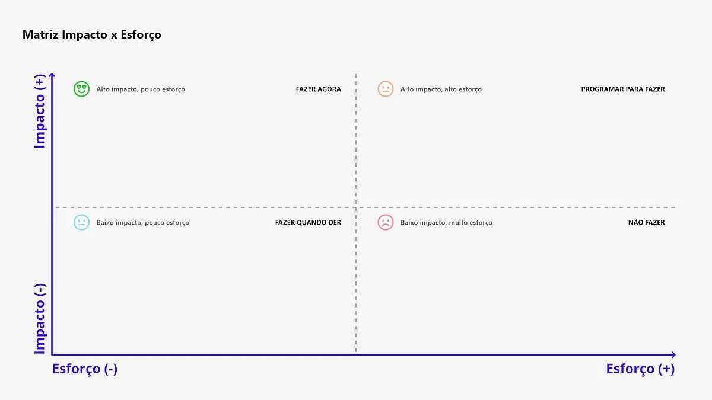

# Matriz de Esforço x Impacto

## Introdução

Este artefato apresenta uma Matriz de Esforço x Impacto aplicada aos requisitos previamente priorizados como de média prioridade. Essa matriz é uma ferramenta estratégica utilizada para avaliar e visualizar o valor gerado por cada requisito em relação ao esforço necessário para sua implementação. O objetivo é identificar quais requisitos apresentam maior viabilidade e impacto, permitindo a alocação eficiente de recursos e esforços no desenvolvimento do sistema. Através dessa análise, torna-se possível priorizar ações que otimizem o valor entregue ao projeto, garantindo um equilíbrio entre esforço e benefício.

## Metodologia

A elaboração da Matriz de Esforço x Impacto seguiu os passos descritos abaixo:

1. **Identificação dos Requisitos:** Os requisitos previamente classificados como média prioridade no artefato de [Priorizados](../foco2/three_level.md) foram selecionados como base para a análise.
2. **Definição de Critérios:**
    - Impacto: Cada requisito foi avaliado quanto ao valor que agrega ao sistema, considerando aspectos como benefícios para os usuários.
    - Esforço: O esforço necessário para implementar cada requisito foi estimado com base na complexidade técnica, recursos necessários e tempo de desenvolvimento.
3. **Posicionamento dos requisitos na matriz:**
    - Q1 - Alto Impacto e Baixo Esforço: Prioridade máxima, pois entregam alto valor com menor esforço.
    - Q2 - Alto Impacto e Alto Esforço: Requisitos importantes, mas que exigem maior planejamento.
    - Q3 - Baixo Impacto e Baixo Esforço: Podem ser implementados como tarefas secundárias.
    - Q4 - Baixo Impacto e Alto Esforço: De baixa prioridade, geralmente evitados.

<b>Figura 1:</b> Matriz de Esforço x Impacto.

<b>Fonte:</b> [siteware](https://www.siteware.com.br/blog/metodologias/matriz-de-esforco-e-impacto/), 2024.

## Resultados

<b>Tabela 1:</b> Requisitos "Médios" posicionados na em função da matriz de Esforço x Impacto.

| Identificador do requisito | Requisito                                                                                                     | Tipo | Origem                                | Quadrante |
|----------------------------|--------------------------------------------------------------------------------------------------------------|------|---------------------------------------|-----------|
| RE-022                     | O sistema deve oferecer uma visão em pipeline do processo de contratação, mostrando o estágio de cada candidato (triagem, entrevista, revisão, oferta, contratação). | RF   | [Priorização](../foco2/three_level.md) | Q1        |
| RE-023                     | O sistema deve permitir a automação de fluxos de trabalho com regras automáticas para tarefas como notificações de entrevistas e rejeições de candidatos com base em critérios. | RF   | [Priorização](../foco2/three_level.md) | Q1        |
| RE-024                     | O sistema deve gerar relatórios sobre a origem dos candidatos e o status de cada um no recrutamento, incluindo gráficos para análise de desempenho. | RF   | [Priorização](../foco2/three_level.md) | Q2        |
| RE-026                     | O sistema deve oferecer uma comunidade para interação, discussão de dúvidas e compartilhamento de soluções para o uso do ATS. | RF   | [Priorização](../foco2/three_level.md) | Q4        |
| RE-030                     | O sistema deve fornecer uma página inicial (dashboard) com visão geral e métricas sobre o processo de recrutamento. | RF   | [Priorização](../foco2/three_level.md) | Q1        |
| RE-031                     | O sistema deve incluir uma área para agendamento e gerenciamento de entrevistas, com funcionalidades de calendário e sincronização com outras ferramentas. | RF   | [Priorização](../foco2/three_level.md) | Q1        |
| RE-032                     | O sistema deve permitir a configuração de regras que automatizem ações, como cancelamento de entrevistas e mudança de status, adaptáveis a diferentes módulos. | RF   | [Priorização](../foco2/three_level.md) | Q2        |
| RE-033                     | O sistema deve oferecer funcionalidades de importação e exportação de dados, backup, armazenamento, lixeira, registro de auditoria e log de atividade. | RF   | [Priorização](../foco2/three_level.md) | Q3        |
| RE-039                     | O sistema deve incluir um painel consolidado para análise de qualidade por canal de recrutamento.             | RF   | [Priorização](../foco2/three_level.md) | Q2        |
| RE-042                     | O sistema deve oferecer fluxos de trabalho escaláveis com etapas personalizáveis por cargo ou departamento.   | RF   | [Priorização](../foco2/three_level.md) | Q2        |
| RE-043                     | O sistema deve disponibilizar ferramentas para organização de entrevistas, incluindo preparação de perguntas e scorecards. | RF   | [Priorização](../foco2/three_level.md) | Q1        |
| RE-044                     | O sistema deve prever datas de aceitação de ofertas e início de trabalho usando aprendizado de máquina baseado em dados históricos. | RF   | [Priorização](../foco2/three_level.md) | Q4        |
| RE-045                     | O sistema deve fornecer formulários de kickoff para capturar objetivos do negócio, habilidades e times de contratação. | RF   | [Priorização](../foco2/three_level.md) | Q2        |
| RE-046                     | O sistema deve incluir um painel de análise demográfica do pipeline, incluindo gênero, para medir diversidade no processo seletivo. | RF   | [Priorização](../foco2/three_level.md) | Q3        |
| RE-047                     | O sistema deve possibilitar a exportação e customização de relatórios, permitindo a criação de relatórios personalizados e integração com ferramentas de BI como Tableau. | RF   | [Priorização](../foco2/three_level.md) | Q2        |
| RE-048                     | O sistema deve possibilitar a integração com mais de 529 ferramentas de terceiros, organizadas por categorias como HRIS & onboarding, Job distribution, Sourcing, entre outras. | RF   | [Priorização](../foco2/three_level.md) | Q4        |
| RE-049                     | O sistema deve permitir atualizações importantes no processo de contratação, como aprovações e lembretes, diretamente no Slack. | RF   | [Priorização](../foco2/three_level.md) | Q3        |
| RE-051                     | O sistema deve incluir ferramentas para incentivar práticas inclusivas, como testes anônimos e seleção de pronomes preferidos. | RF   | [Priorização](../foco2/three_level.md) | Q2        |
| RE-054                     | O sistema deve exibir métricas gerais do processo seletivo em um dashboard centralizado, incluindo status de candidatos e insights sobre o funil de recrutamento. | RF   | [Priorização](../foco2/three_level.md) | Q1        |
| RE-055                     | O sistema deve permitir o envio de cartas de oferta com preenchimento automático e assinatura eletrônica para agilizar a formalização da contratação. | RF   | [Priorização](../foco2/three_level.md) | Q2        |
| RE-058                     | O sistema deve permitir a sincronização com calendários para agendamento e gerenciamento de entrevistas e eventos relacionados ao recrutamento. | RF   | [Priorização](../foco2/three_level.md) | Q1        |
| RE-060                     | O sistema deve incluir lembretes automáticos sobre prazos, feedbacks pendentes e outras ações requeridas no processo seletivo. | RF   | [Priorização](../foco2/three_level.md) | Q1        |
| RE-065                     | O sistema deve permitir a disponibilização de links úteis para a equipe, como acesso a documentos, políticas e recursos da empresa. | RF   | [Priorização](../foco2/three_level.md) | Q3        |
| RE-076                     | O sistema deve incluir um assistente de inteligência artificial para suporte em tempo real, respondendo a perguntas sobre políticas da empresa, benefícios e procedimentos de RH. | RF   | [Priorização](../foco2/three_level.md) | Q4        |
| RE-082                     | O sistema deve oferecer a opção de salvar relatórios frequentemente acessados como favoritos para facilitar análises recorrentes. | RF   | [Priorização](../foco2/three_level.md) | Q3        |
| RE-083                     | O sistema deve exibir relatórios recentes acessados, organizados por período, como últimos 7 dias, com opções para abrir e editar. | RF   | [Priorização](../foco2/three_level.md) | Q3        |
| RE-084                     | O sistema deve apresentar uma tela de boas-vindas interativa para novos usuários, com vídeos explicativos e passos guiados. | RF   | [Priorização](../foco2/three_level.md) | Q4        |
| RE-087                     | O sistema deve gerenciar modelos de assinatura para contratos e outros documentos legais.                   | RF   | [Priorização](../foco2/three_level.md) | Q3        |
| RE-088                     | O sistema deve centralizar documentos importantes como manuais da empresa, políticas de reembolso e resumos de benefícios. | RF   | [Priorização](../foco2/three_level.md) | Q3        |

<b>Autor 1:</b> Vitor Feijó, 2024.

## Bibliografia

></a> 1. SITEWARE. Matriz de esforço e impacto: o que é e como fazer? Siteware Blog. Disponível em: [https://www.siteware.com.br/blog/metodologias/matriz-de-esforco-e-impacto/](https://www.siteware.com.br/blog/metodologias/matriz-de-esforco-e-impacto/). Acesso em: 17 nov. 2024.

## Histórico de versão

| Versão | Data | Descrição | Autor(es) |
| :-: | :-: | :-: | :-: |
| `1.0` | 10/11/2024 | Criação do artefato de three-level scale | Vitor Feijó |
| `1.1` | 17/11/2024 | Preenchimento do artefato | Vitor Feijó |
