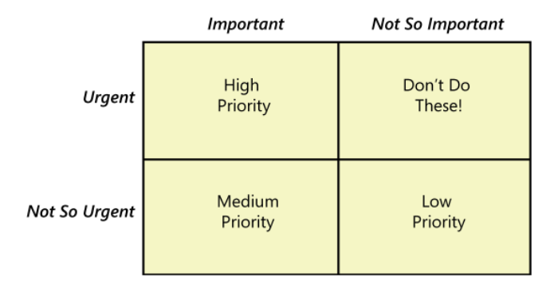

# Priorização 

## Introdução

A Three-Level Scale é uma abordagem prática para priorizar requisitos com base em duas dimensões: importância e urgência (Covey, 2004). Essa escala considera que cada requisito pode ser avaliado como importante ou não importante, e urgente ou não urgente, resultando em quatro combinações possíveis. Esse método permite classificar e organizar os requisitos de forma relativa, auxiliando no alinhamento estratégico e na tomada de decisões eficientes. O artefato proposto utiliza essa metodologia para definir uma escala de prioridades clara, orientando a execução de atividades e o alcance de objetivos de negócios. A Figura 1 determina a lógica da técnica visualmente. 

<b>Figura 1:</b> Priorização de requisitos baseada na importância e urgência.

<b>Fonte:</b> Software Requirements, Third Edition. Karl Wiegers and Joy Beatty.

## Metodologia

Como descrito por Wiegers e Beatty, os requisitos serão classificados nas categorias:

1. **Alta prioridade:** Urgente e importante. Os requisitos dessa categoria são extremamente importantes e urgentes, ou seja, os clientes e usuários precisam deles presente na próxima release. Existe também uma alternativa onde um requisito é categorizado como de alta prioridade por um contrato ou acordo. Se o requisito pode esperar a implementação sem prejudicar o andamento do projeto, então ele não se encaixa nessa categoria.
2. **Média prioridade:** Não Urgente e importante. São requisitos importantes mas que não são urgentes, ou seja, mesmo precisando ser implementados eles podem esperar uma próxima release.
3. **Baixa prioridade:** Não urgente e não importante. São requisitos que não são nem importantes e nem urgentes, podendo ser adiados e nem implemntados, se for o caso.

Também existe uma quarta categoria que diz a respeito de requisitos que podem parecer de extrema importância para o cliente, mas que no fim são completamente desnecessários para o funcionamento do projeto.

## Legenda para tabela de requisitos

1. **Identificador:** Código único para cada requisito, usado para identificação e referência rápida, onde RE significa Requisito Elicitado.
2. **Requisito:** Descrição do que o sistema deve realizar.
3. **Tipo:** Qual o tipo de requisito, onde RF significa Requisito Funcional e RNF significa Requisito Não Funcional.
4. **Prioridade:** Prioridade dada pelo usuário, Alta ou Média ou Baixa.

## Resultados

<b>Tabela 1:</b> Requisitos priorizados.

| Identificador | Tipo | Requisito | Prioridade |
| :-: | :-: | :-: | :-: |
| RE001 | RF | O sistema deve | Média |

<b>Autor:</b> Vitor Feijó, 2024.

## Bibliografia

></a> 1. Software Requirements Third Edition. In: WIEGERS, Karl E.; BEATTY, Joy. Software Requirements. 3. ed. [S. l.]: Microsoft Press, 2013. cap. 16, p. 313-329. ISBN 0735679665. Disponível em: [https://www.booksfree.org/wp-content/uploads/2022/03/Software_Requirements_3rd_Edition_compressed.pdf](https://www.booksfree.org/wp-content/uploads/2022/03/Software_Requirements_3rd_Edition_compressed.pdf)

## Histórico de versão
| Versão | Data | Descrição | Autor(es) |
| :-: | :-: | :-: | :-: |
| `1.0` | 08/11/2024 | Criação do artefato de three-level scale | Vitor Feijó |
| `1.1` | 18/11/2024 | Preenchimento do artefato | Vitor Feijó |